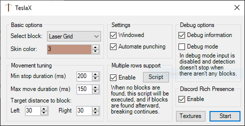

# TeslaX
Farming bot for Growtopia.  
I'm not always maintaining the Releases tab, so if the last compiled version isn't up to date, please clone and build the project yourself. .NET Framework 4.7.2 is required.  
For any questions contact me at TheLeftExit#4325 on Discord.

The project contains pointer offsets for values such as player's location, direction and world block data. You can use them in your projects if you want to.

Recent version's interface:  

## How this works
 - Stand in front of a row of blocks.
 - Click "Detect" to make sure the tool is working. It should display ID and distance to the block you're facing.
 - Set "Block ID" to value from the status bar (either foreground or background).
 - Press Start (or Alt+S) to start breaking.
 - The tool will keep breaking until there are no more blocks or you manually cancel it.
 - You can the tool to break multiple rows automatically. For that you will need to specify "Door ID" and end-of-row script, and enable the feature.

## Notes
This project has recently been updated from graphical detection to directly working with the game's memory. For previous versions, check `graphics-based` branch.  
The wiki may be outdated.