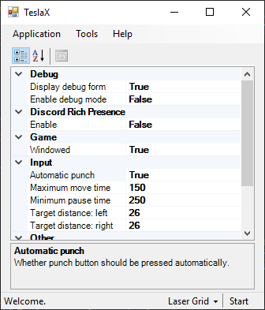

# TeslaX
Farming bot for Growtopia.  
Development is abandoned, but the latest version is pretty stable.  

The tool should still work as of April 2021, but you'll need to clone the project, change pointer values in `TeslaX/Static/Process.cs` and build it yourself. Think of it as a LEGO toy.  

For any questions contact me at theleftexit@protonmail.com.

### What do you mean "change pointer values"?
This project uses game memory to figure out things like player position/direction and block data. These values (first found by yours truly) are located with multi-level pointers that change with different game client versions. Since Ubisoft hasn't changed the way they're stored in, like, forever, you can still find them yourself.  

They can easily be found in a few minutes with Cheat Engine, and it's sorta fun to find them yourself. Play around with "What accesses this address" menu (CE's built-in tutotial will help understand how that works). Once you find any, getting the rest should be easy.  
Bottom line is, you'll need to find them again once they change with in the next game version, and I'm not aware of any forums/servers sharing this stuff.  

## Overview
What this tool CAN do:
 - Simulate human-like keyboard input to move forward and punch, breaking lines of blocks.
 - Advance to the next row IF the feature is configured and used properly.
 - Overall, help in a normal farming routine by automating the breaking process.

What this tool CANNOT do:
 - Place any blocks.
 - Break blocks that aren't placed in a straight line.
 - Hack the game, steal accounts, etc.  
(I've had issues from children trying to do that, so I have to mention it)

Recent version's interface:  

## How this works
 - Stand in front of a row of blocks.
 - Click "Detect" to make sure the tool is working. It should display ID and distance to the block you're facing.
 - Set "Block ID" to value from the status bar (either foreground or background).
 - Press Start (or Alt+S) to start breaking.
 - The tool will keep breaking until there are no more blocks or you manually cancel it.
 - You can configure the tool to break multiple rows automatically. For that you will need to specify "Door ID" and end-of-row script, and enable the feature.  
One of possible scenarios: walk forward for 1000 ms, punch (enter the door), wait for 1000 ms - will work with one-side-blocked Door pointing to a Path Marker.

## Notes
This project has recently been updated from graphical detection to directly working with the game's memory. For previous versions, check `graphics-based` branch.  
The wiki may be outdated.
